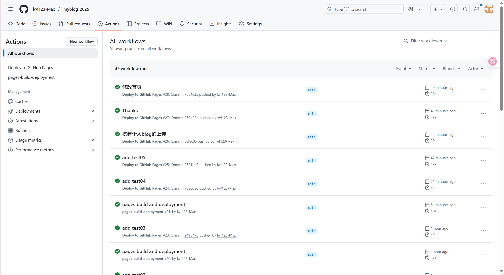
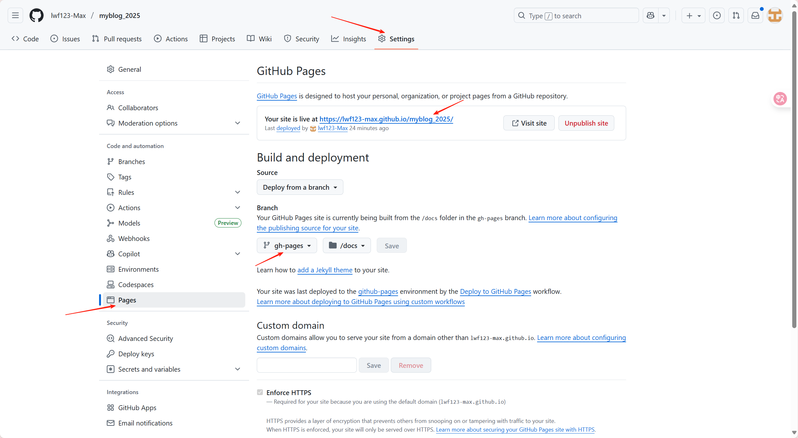

# 你好大千世界

## 搭建个人blog

### 下载Node

下载node.js,去官网[[Node.js — Download Node.js®](https://nodejs.org/zh-cn/download)](https://nodejs.org/en/blog/release/v22.18.0)下载msi文件，按步骤安装就行，然后重点！


### 环境变量配置

进行环境变量配置 找到安装的目录，在安装目录下新建两个文件夹【node_global】和【node_cache】 创建完毕后，使用管理员身份打开cmd命令窗口，输入 npm config set prefix “你的路径\node_global” npm config set cache “你的路径\node_cache”

- ***环境变量的系统变量新建***

  变量名：NODE_PATH

  变量值："你node的安装目录"\nodejs\node_global\node_modules

- 将用户变量的path进行一个编辑 将默认的C换成node_global的路径

- 系统变量的path也新建一个%NODE_PATH%

### vue的安装及相关配置

1. 创建项目文件夹，然后cd到那个文件夹

2. npm init -y 会生成`package.json` 文件

3. npm install -D vuepress，但是国内好慢 npm install -D vuepress --registry https://registry.npmmirror.com

4. 目录结构如下 可以用一下命令

   ```text
   mkdir docs
   mkdir docs\.vuepress
   type nul > docs\.vuepress\config.mjs
   type nul > docs\README.md
   ```

5. 编写 `config.mjs`

   ```text
   // docs/.vuepress/config.mjs
   import { viteBundler } from '@vuepress/bundler-vite';
   import { hopeTheme } from 'vuepress-theme-hope';
   
   export default {
     title: '我的个人博客',
     description: '记录学习与生活的点滴',
     base: '/myblog_2025/',
     
     // 添加 bundler 配置
     bundler: viteBundler(),
     
     theme: hopeTheme({
       navbar: [
         { text: '🏠 首页', link: '/' },
         { text: '📚 文章', link: '/blog/' },
         { 
           text: 'GitHub', 
           link: 'https://github.com/lwf123-Max/myblog_2025',
           icon: "github" 
         },
       ],
       
       sidebar: {
         "/blog/": [
           {
             text: "✨ 初始文章",
             collapsible: true,
             children: ["hello.md", "cjlulwf.md"],
           }
         ]
       },
       
       blog: {
         name: "我的博客",
         description: "记录学习与生活的点滴",
       },
       
       plugins: {
         blog: true,
         mdEnhance: {
           lineNumbers: true,
         },
       },
     }),
     
     markdown: {
       toc: {
         level: [2, 3]
       }
     }
   };
   ```

6. `package.json`这个很重要

   ```text
   {
     "name": "doclog",
     "version": "1.0.0",
     "scripts": {
       "docs:dev": "vuepress dev docs",
       "docs:build": "vuepress build docs",
       "deploy": "npm run docs:build && gh-pages -d docs/.vuepress/dist -b gh-pages --no-history --dotdot ."
     },
     "devDependencies": {
       "gh-pages": "^6.3.0",
       "sass-embedded": "^1.90.0",
       "vuepress": "^2.0.0-rc.24",
       "vuepress-theme-hope": "^2.0.0-rc.94"
     },
     "dependencies": {
       "@vuepress/bundler-vite": "2.0.0-rc.24"
     }
   }
   ```

7. 运行 `npm run docs:dev`

   但是报错：

   ```
   D:\docLog>npm run docs:dev 
   > doclog@1.0.0 docs:dev 
   > vuepress dev docs 
   
   wait Extracting site metadata... Error: Cannot resolve theme: reco.    at resolveTheme (D:\docLog\node_modules\@vuepress\core\lib\node\loadTheme.js:111:13)    at loadTheme (D:\docLog\node_modules\@vuepress\core\lib\node\loadTheme.js:36:17)    at App.process (D:\docLog\node_modules\@vuepress\core\lib\node\App.js:105:21)    at process.processTicksAndRejections (node:internal/process/task_queues:105:5)    at async dev (D:\docLog\node_modules\@vuepress\core\lib\index.js:17:3)
   ```

   解决：

   **问题原因**：`vuepress-theme-reco`主题未安装或安装失败。

   **解决方法**：

   ```
   npm install vuepress-theme-reco@1.x --save-dev
   ```

   确保安装的版本与你的 VuePress 版本兼容（VuePress 1.x 对应 `vuepress-theme-reco@1.x`）

   先在github中创建自己的仓库

   在你创建的项目doclog中继续执行

   ```
   git init
   git add .
   git remote add origin https://github.com/你的用户名/你的仓库名.git
   git commit -m "Initial commit"
   git push -u origin master
   ```

   但是我push的时候一直有问题：

   ```
   D:\docLog>git push origin main --force
   fatal: unable to access 'https://github.com/lwf123-Max/myblog_2025.git/': Failed to connect to github.com port 443 after 21090 ms: Could not connect to server
   ```

   所以我是这样解决的：

   ### **切换 HTTPS 到 SSH 协议**

   既然 SSH 认证成功，直接改用 SSH 协议推送可绕过 HTTPS 连接问题：

   ```
   git remote set-url origin git@github.com:lwf123-Max/myblog_2025.git
   git push -u origin main
   ```

   ```
   D:\docLog>git push -u origin main
   Enumerating objects: 27698, done.
   Counting objects: 100% (27698/27698), done.
   Delta compression using up to 12 threads
   Compressing objects: 100% (19570/19570), done.
   Writing objects: 100% (27698/27698), 39.26 MiB | 836.00 KiB/s, done.
   Total 27698 (delta 7080), reused 27698 (delta 7080), pack-reused 0 (from 0)
   remote: Resolving deltas: 100% (7080/7080), done.
   To github.com:lwf123-Max/myblog_2025.git
    * [new branch]        main -> main
   branch 'main' set up to track 'origin/main'.
   ```

   到这一步，恭喜你成功创建好了仓库! 后面上场的自动部署才是最难的，QAQ——
   
   

### 自动部署

在根目录下创建`.github/workflows/deploy.yml`

```
name: Deploy to GitHub Pages

on:
  push:
    branches: [main]

jobs:
  deploy:
    runs-on: ubuntu-latest
    permissions:
      contents: write
      pages: write
      id-token: write
    environment:
      name: github-pages
      url: ${{ steps.deployment.outputs.page_url }}
    
    steps:
      - name: Checkout
        uses: actions/checkout@v4
        with:
          fetch-depth: 0
          submodules: false
          
      - name: Clean cache
        run: |
          npm cache clean --force
          rm -rf node_modules
          
      - name: Install dependencies
        run: npm ci  # 更严格的全新安装
      
      - name: Setup Node.js
        uses: actions/setup-node@v4
        with:
          node-version: 20
          cache: 'npm'
          
      - name: Install dependencies
        run: npm ci
        
      - name: Verify files
        run: |
          echo "项目结构:"
          ls -la
          echo "VuePress 配置:"
          ls -la docs/.vuepress/
          [ -f docs/.vuepress/config.mjs ] && echo "✅ config.mjs 存在" || echo "❌ config.mjs 缺失"
        
      - name: Build site
        run: npm run docs:build
        
      - name: Move files to /docs
        run: |
          # 清空docs目录（保留目录结构）
          rm -rf ./docs/*
          # 将构建文件复制到/docs目录
          cp -r docs/.vuepress/dist/* ./docs/
          
      - name: Upload artifact
        uses: actions/upload-pages-artifact@v3
        with:
          path: ./docs/.vuepress/dist
          
      - name: Deploy to GitHub Pages
        id: deployment
        uses: actions/deploy-pages@v4
```

确保在指定的文件夹创建好这个文件，然后git上去

```
git add .
git commit -m "Add GitHub Actions deploy config"
git push -u origin main 
# 请你确认好是main还是master
```

### 工作流查看

到这一步你点开github仓库中的Actions



若最新的***工作流***左边的圆圈打着绿色的√，说明你的自动部署已经快成功了，此时点开你的个人博客网址，可能出现404这样的问题。

### 博客网址404**解决**方法



修改Pages中的这些参数：

```
Source: Deploy from a branch
Branch: gh-pages
- Folder: /docs
```

此时就可以正常访问你搭建的个人网站啦！（`https://'github用户名'.github.io/myblog_2025/`)

### `docs`目录结构

以下是我的`docs`的tree，仅供参考

```
D:.
├─.vuepress
│  ├─.cache
│  │  └─deps
│  ├─.temp
│  │  ├─blog
│  │  ├─components
│  │  ├─git
│  │  ├─icon
│  │  ├─internal
│  │  ├─markdown-chart
│  │  ├─markdown-ext
│  │  ├─markdown-image
│  │  ├─markdown-stylize
│  │  ├─pages
│  │  │  ├─article
│  │  │  ├─blog
│  │  │  ├─category
│  │  │  ├─posts
│  │  │  ├─star
│  │  │  ├─tag
│  │  │  └─timeline
│  │  ├─redirect
│  │  ├─sass-palette
│  │  ├─shiki
│  │  └─theme-hope
│  ├─dist
│  │  ├─article
│  │  ├─assets
│  │  ├─blog
│  │  ├─category
│  │  ├─posts
│  │  ├─star
│  │  ├─tag
│  │  └─timeline
│  └─public
│      └─images
│          └─blog
├─blog
└─tag
```


最后在这里感谢***许羽涵***同学的开源教程
